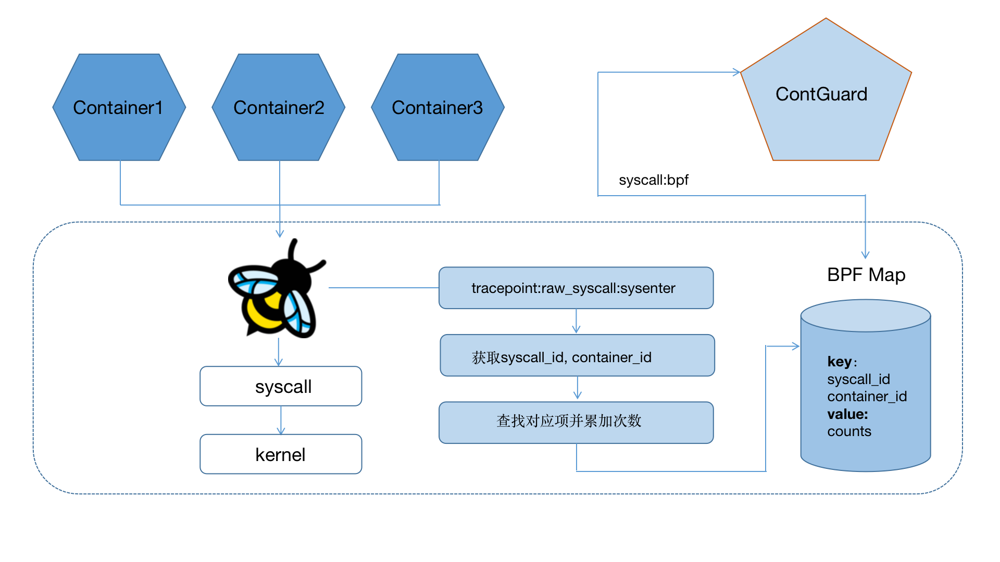
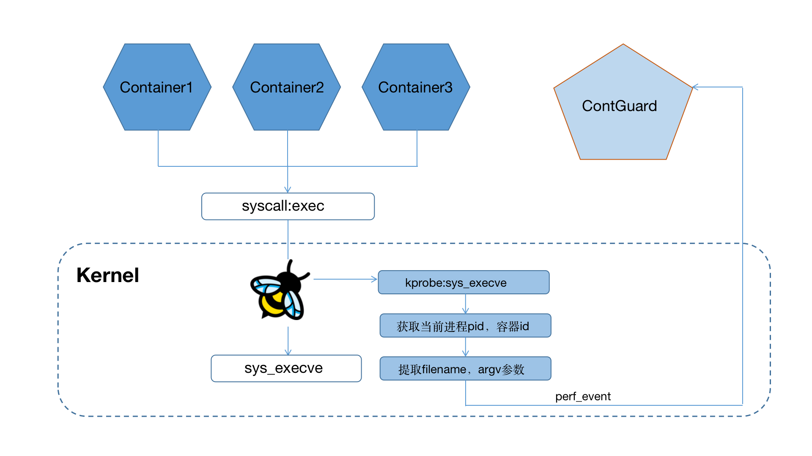
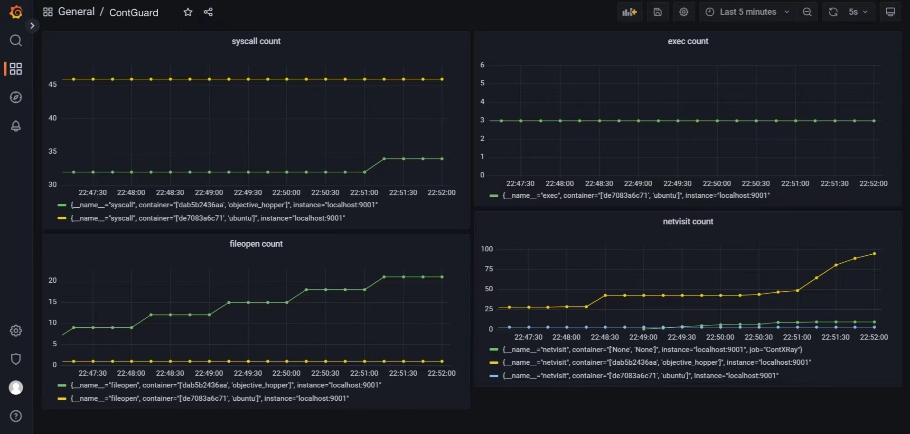

# ContGuard ( Container Guard )


- [ContGuard ( Container Guard )](#Container Guard)
  - [项目介绍](#项目介绍)
  - [前期准备与问题解决](#准备与问题解决)
  - [目录结构](#目录结构)
  - [架构设计](#架构设计)
  - [功能模块设计](#功能模块设计)
    - [容器使用的系统调用](#容器使用的系统调用)
    - [容器内程序执行](#容器内程序执行)
    - [容器内文件打开](#容器内文件打开)
    - [容器间互访](#容器间互访)
  - [Promethus/Grafana数据可视化](#Prometheus/Grafana数据可视化)
  - [容器异常检测算法](#容器异常检测算法)
  - [参考资料](#参考资料)

---

## 项目介绍

近年来，由于容器的可扩展、轻量级等优点，基于容器的虚拟化（如Docker）在云计算中越来越受欢迎。与传统的基于虚拟机监视器（VMM）的虚拟化不同，基于容器的虚拟化技术共享相同的底层主机操作系统(OS)，而没有VMM和Guest OS。这种差异有助于容器消除大部分虚拟机(VM)所遭受的开销。最近的研究表明，在各种工作负载下，容器在CPU、内存和输入/输出方面实现了接近原生性能。虽然容器的轻量级隔离机制带来了开销优势，但是隔离不足也会导致容器异常。因此容器异常事件频发，例如性能不稳定、系统崩溃和安全问题。

eBPF（extended Berkeley Packet Filter）是一种内核技术，它允许开发人员在不修改内核代码的情况下运行特定的功能。eBPF 的概念源自于 Berkeley Packet Filter（BPF），后者最初是由贝尔实验室开发的一种捕获和过滤网络数据包的过滤器。eBPF经过不断的发展和功能完善已经被广泛应用于网络监控、安全过滤、性能分析等多种场景中。eBPF的强大能力也为容器异常检测提供了更多的机会。容器技术通过共享主机操作系统的内核，实现轻量的资源虚拟化和隔离，近年来在DevOps、微服务等领域有着广泛的应用。然而在容器技术被广泛接受和使用的同时，容器以及容器运行环境的安全成为了亟待研究和解决的问题，诸如容器逃逸、容器间网络攻击等。

ContGuard是一个基于eBPF技术的容器行为观测工具。

为了帮助解决上述问题，我们基于Linux内核中的eBPF技术，打造了一个可以动态观测容器行为的工具**ContGuard**。通过eBPF技术，ContGuard可以实现对容器的无侵入式的动态观测，包括容器所使用的系统调用、对文件的访问、进程的执行、容器间网络互访等，收集到的信息经过分析后可通过Seccomp等工具对容器进行更细粒度的权限控制，从而最大程度降低攻击平面，保证容器的运行安全。最后借助借助grafana等UI系统，实现各种数据的汇总展示以及异常容器检测时的分析流程展示。

本项目旨在通过ebpf实现容器异常检测框架。该框架通过ebpf收集容器的行为特征（例如系统调用频率、系统调用序列、文件访问、网络通信等活动）、指标特征（例如IO吞吐、内存利用率、CPU利用率等）等数据，采用人工智能算法自动识别具有异常行为的容器。检测的容器异常行为包括：可疑的系统调用、未经授权的容器互访、容器内异常进程的创建、异常的资源使用量等。

## 前期准备与问题解决

- 准备Linux环境，我们没有选择使用虚拟机，而是远程连接Linux主机

```
ssh username@IPv4address
```
然后输入密码

- 向远程主机上传所需文件，注意目录的指定

```
scp /path/to/local/file username@remote_host:/path/to/remote/directory
```

- 如果未配置好BCC(BPF Compiler Collection)环境，需要先配置BCC以及所需的内核头文件：

```
sudo apt-get install bpfcc-tools linux-headers-$(uname -r)
```

- 项目程序目录为`src`，以下操作均需要在此目录操作

```
cd src
```

- 安装所需的python依赖模块：
若未安装pip3：
```
sudo apt install python3-pip 
```
```
sudo pip3 install -r ./requirements.txt
```

- 设置ContGuard执行权限

```
sudo chmod +x ./ContGuard.py
```

- 运行ContGuard文件

```
sudo ./ContGuard.py
```

- 查看运行结果

    exec、fileopen、netvisit信息会在CLI输出，syscall信息会在相应的日志文件输出。

- 查看运行日志

    日志保存在 `./logs/` 中，以syscall、exec、fileopen、netvisit名称为前缀，时间戳为后缀保存。

    清空日志可使用 `bash ./clearlog.sh`
    
### Prometheus/Grafana数据可视化配置

- 安装prometheus

```
sudo apt install prometheus
```

- 通过docker安装grafana

```
sudo docker pull grafana
sudo docker run -itd -p 3000:3000 grafana
```

- 查看prometheus配置文件：

```
sudo nano /etc/prometheus/prometheus.yml
```

- 修改promethus配置文件`/etc/prometheus/prometheus.yml `，在末尾添加以下内容：

```yaml
  - job_name: ContGuard
    static_configs:
      - targets: ['remote_ip:9001']
```

- 启动 Prometheus 服务：
```
sudo systemctl start prometheus
```

- 查看 Prometheus 服务状态:
```
sudo systemctl status prometheus
```

- Prometheus可视化查看：
浏览器打开`http://remote_ip:9090`，输入需要监测的指标对应的promql指令，可以直接看到监测图像

- 配置Grafana数据源，添加Prometheus源，url为http://remote_ip:9090

- 导入Grafana Dashboard配置文件`./src/grafana_panel_json.txt`

- 先启动ContGuard.py，再运行p_expoter.py文件，操作如下：

```
sudo ./ContGuard.py
```
control+z先暂停，再将其在后台运行
```
bg %1
```
检查后台运行任务
```
jobs -l
```
再运行p_expoter.py
```
sudo python3 ./p_expoter.py
```
若运行文件p_expoter.py 遇到问题：未安装模块，则执行
`sudo apt install python3-prometheus-client`

- 在浏览器中打开`http://remote_ip:3000`，进入Dashboard查看


## 目录结构

```
.
├── docs                        相关文档
├── LICENSE                     LICENSE
├── README.md                   README
└── src                         source code
    ├── bpf.c                   eBPF C程序
    ├── clearlog.sh             清除历史日志shell脚本
    ├── ContGuard.py            ContGuard主程序
    ├── data_save.py            数据保存模块
    ├── gen_seccomp.py          seccomp profile生成工具
    ├── grafana_panel_json.txt  Grafana Dashboard配置文件
    ├── logs                    日志目录
    ├── p_expoter.py            prometheus expoter
    └── requirements.txt        python依赖库列表
```

## 架构设计


## 功能模块设计

### 容器使用的系统调用
Docker容器的默认安全配置存在一个较大的攻击平面，Linux内核提供了300多个系统调用，而Seccomp默认会对所有容器禁用44个系统调用。经过测试，大多数容器只需要100多个系统调用，而那些多出来而未被禁用的系统调用，更有可能成为攻击的跳板。
ContGuard通过 `tracepoint:raw_syscalls`，动态监控容器使用的系统调用，并把这些系统调用的名字、使用的次数记录下来，为后期分析提供数据支撑

具体实现原理:[get_syscall.md](./docs/get_syscall.md)



> 测试：nginx容器被web访问一次所使用的系统调用 

- JSON形式输出

```json
{
    "['cb955a6f946', 'nginx']": { //容器id 容器名
        "recvfrom": 2, //系统调用名:次数
        "writev": 1,
        "setsockopt": 1,
        "sendfile": 1,
        "fstat": 1,
        "write": 1,
        "stat": 1,
        "epoll_ctl": 1,
        "openat": 1,
        "epoll_wait": 3,
        "accept4": 1,
        "close": 2
    }
}
```

### 容器内程序执行
通常每个容器中运行一组数量有限且明确定义的正常进程，这些进程都是相对稳定和一致的，任何新进程的执行都是存在一定安全风险的。

攻击者可利用应用程序的漏洞、错误配置等进入容器，然后以这个容器为跳板，对内部网络进行探测，进而发现其它容器或者宿主机的进程和文件系统中的弱点来加以进一步利用和攻击。被恶意攻击占领的容器会启动非法进程，如端口扫描进程和反向 Shell 进程等。

ContGuard通过 `kprobe:sys_execve`动态监控容器内进程调用exec执行程序的行为，并获取发起exec的进程pid、command，以及exec中的参数filename、argv等数据，方便后期进行数据分析和异常检测。

具体实现原理:[get_exec.md](./docs/get_exec.md)



> 测试：ubuntu容器内使用cat test.txt

- CLI形式输出

```
exec:::cid-7c6f36ef5c8-ubuntu1,pid:1549540,comm:bash-->filename:/usr/bin/cat,argv:test.txt
```

- JSON形式输出

```json
{
    "['7c6f36ef5c8', 'ubuntu1']": [ //容器id 容器名
        [
            1549540, //执行exec系统调用的进程pid
            "bash", //该进程的command
            "/usr/bin/cat", //exec filename
            "test.txt",//exec argv
            1653726667 //时间戳
        ]
    ]
}
```

### 容器内文件打开

通常，容器内通过Mount Namespace实现了文件系统资源层面的隔离。但由于一些业务的实际需要，需要与宿主机之间共享一部分文件和目录，甚至是 `/proc`、`/dev`等敏感目录。在一般情况下，容器内的程序仅对某些文件或目录进行操作，而当容器被攻击者挟持，成为跳板后，攻击者往往会通过漏洞扫描工具对系统进行扫描，甚至是构造反弹shell的方式进行容器逃逸或者其它攻击行为。

ContGuard通过 `kprobe::do_sys_openat`动态监控容器内文件打开操作。由于在容器内部，open操作是相当频繁的，如果不对数据进行过滤会导致发送大量与正常业务相关的open操作行为数据，所以ContGuard在BPF程序中做了过滤。在一般情况下，容器内部使用的是Overlay文件系统，该文件系统使用层级的结构，大幅度减少了容器占用的存储空间。而Overlay文件系统内部的文件，大多是容器镜像自身所包含的，这些文件的访问不会涉及到安全问题。而对与宿主机共享的文件目录的打开，相对来说是十分敏感的。ContGuard针对这些敏感数据的open行为做了监控，并获取到了执行open的进程的pid、command信息，以及文件名、文件系统等信息。

具体实现原理:[get_fileopen.md](./docs/get_fileopen.md)


> 测试：从ubuntu容器内打开与宿主机共享目录cont_share中的test.txt文件

- CLI形式输出

```
fileopen:::cid:7c6f36ef5c8-ubuntu1,pid:1549540,comm:cat-->fs:ext4,filename:/home/ubuntu/cont_share/test.txt
```

- JSON形式输出

```json
{
    "['7c6f36ef5c8', 'ubuntu1']": [
        [
            1549540, //pid
            "cat", //command
            "/home/ubuntu/cont_share/test.txt", //文件名
            "ext4", //文件系统
            1653726667 //时间戳
        ]
    ]
}
```

### 容器间互访

容器间互访的方式有进程间通信、网络互访等，考虑到容器网络安全层面，ContGuard目前针对容器网络的方式进行容器间访问检测。

在Linux上容器网络的隔离手段是net_namespace,其可以为不同的命名空间从逻辑上提供独立的网络协议栈，具体包括网络设备、路由表、arp表、套接字(socket)等，使得不同的网络空间都像运行在独立的网络中一样：


Netnamespace的网络隔离，使得各容器在逻辑上独占网络协议栈，但实际上还是共享Linux内核网络协议栈进行网络数据的处理，利用各容器都是从同一个宿主机上的网络协议栈处理数据，那么利用eBPF设计容器互访检测大体架构如下：


> 测试：从ubuntu容器使用curl访问nginx容器

- CLI形式输出

```
exec:::cid-cd5a737db6b-ubuntu1,pid:406332,comm:bash-->filename:/usr/bin/curl,argv:172.17.0.3
net:::scid:39841878b98-nginx1(port:80 common:nginx)-->dcid-cd5a737db6b-ubuntu1(port:33428 common:curl)
net:::scid:cd5a737db6b-ubuntu1(port:33428 common:curl)-->dcid-39841878b98-nginx1(port:80 common:nginx)
net:::scid:39841878b98-nginx1(port:80 common:nginx)-->dcid-cd5a737db6b-ubuntu1(port:33428 common:curl)
net:::scid:cd5a737db6b-ubuntu1(port:33428 common:curl)-->dcid-39841878b98-nginx1(port:80 common:nginx)
net:::scid:cd5a737db6b-ubuntu1(port:33428 common:curl)-->dcid-39841878b98-nginx1(port:80 common:nginx)
```

- JSON形式输出

```json


"['39841878b98', 'nginx1']": [ //src container
    [
        80, //source port
        "nginx", // source comm
        "['cd5a737db6b', 'ubuntu1']", //dest container
        33428, //dest port
        "curl" //dest comm
    ],
    [
        80,
        "nginx",
        "['cd5a737db6b', 'ubuntu1']",
        33428,
        "curl"
    ]
    ],
        "['cd5a737db6b', 'ubuntu1']": [
        [
        33428,
        "curl",
        "['39841878b98', 'nginx1']",
        80,
        "nginx"
    ],
    [
        33428,
        "curl",
        "['39841878b98', 'nginx1']",
        80,
        "nginx"
    ],
    [
        33428,
        "curl",
        "['39841878b98', 'nginx1']",
        80,
        "nginx"
    ]
    ]
}


```
## Prometheus/Grafana数据可视化



## Seccomp Docker Profile生成

可以根据ContGuard生成的syscall调用信息，生成该容器所需的系统调用白名单列表，从而最大程度降低攻击平面。

可通过`gen_seccomp.py`生成：

```
./gen_seccomp.py container_name file1 file2 ... fileN
```

该工具运行后，会生成一个`container_name_profile.json`文件，可以通过以下方式使用

```
docker run --rm \
             -it \
             --security-opt seccomp=/path/to/seccomp/profile.json \
             hello-world
```

## 容器异常检测算法

受文献[Zhuping Zou](https://ieeexplore.ieee.org/author/37089323827)等人文献《[A Docker Container Anomaly Monitoring System Based on Optimized Isolation Forest](https://ieeexplore.ieee.org/abstract/document/8807263)》(DOI:[10.1109/TCC.2019.2935724](https://doi.org/10.1109/TCC.2019.2935724))启发，可以利用孤立森林算法对容器异常进行检测。但是原始孤立森林算法存在着诸多缺陷，需要对其进行改进，以增加检测性能。

我们通过对数据进行预处理，降低其波动性，并修改原有PathLength算法，可以在一定程度上增加了准确率并降低了误报率。

## 参考资料

1.绿盟科技容器安全技术报告(https://www.nsfocus.com.cn/upload/contents/2018/11/20181109100414_79051.pdf)

2.绿盟云原生安全技术报告(https://www.nsfocus.com.cn/html/2021/101_0705/160.html)

3.eBPF技术介绍(https://www.ebpf.top/post/ebpf_intro/)

4.基于eBPF实现容器运行时安全(https://www.ebpf.top/post/ebpf_container_security/)

5.BCC 到 libbpf 的转换指南(https://www.ebpf.top/post/bcc-to-libbpf-guid/)

6.bcc Reference Guide(https://github.com/iovisor/bcc/blob/master/docs/reference_guide.md)

7.容器Cgroup和Namespace特性简介(https://zhuanlan.zhihu.com/p/80733932)

8.特权模式下Docker逃逸手法总结(https://mp.weixin.qq.com/s/JAJumU78zzZtBkjXffXzyQ)

9.How Docker Works(https://www.youtube.com/watch?v=-YnMr1lj4Z8)

10.邢云龙-基于系统调用限制的容器安全防护方案-武汉大学学报(https://kns.cnki.net/kcms/detail/detail.aspx?dbcode=CJFD&dbname=CJFDLAST2022&filename=WHDY202201005)

11.MiniCon: Automatic Enforcement of a Minimal Capability Set for Security-Enhanced Containers(DOI:10.1109/IEMTRONICS52119.2021.9422529)

12.Docker容器网络通信原理分析(https://bbs.huaweicloud.com/blogs/257891)

13.Docker, 2024, https://www.docker.com/. (Accessed March 7, 2024).

14.P. Sharma, L. Chaufournier, P. Shenoy, Y. Tay, Containers and virtual machines at scale: A comparative study, in: Proceedings of International Middleware Conference, Middleware, 2016, pp. 1–13.

15.M. Plauth, L. Feinbube, A. Polze, A performance survey of lightweight virtualization techniques, in: Proceedings of European Conference on Service-Oriented and Cloud Computing, ESOCC, 2017, pp. 34–48.

16.Y. Li, J. Zhang, C. Jiang, J. Wan, Z. Ren, PINE: Optimizing performance isolation in container environments, IEEE Access 7 (2019) 30410–30422. 

17.J. Khalid, E. Rozner, W. Felter, C. Xu, K. Rajamani, A. Ferreira, A. Akella, Iron: Isolating network-based CPU in container environments, in: Proceedings of USENIX Symposium on Networked Systems Design and Implementation, NSDI, 2018, pp. 313–328.

18.S. Soltesz, H. Pötzl, M.E. Fiuczynski, A. Bavier, L. Peterson, Container-based operating system virtualization: A scalable, high-performance alternative to hypervisors, in: Proceedings of European Conference on Computer Systems, EuroSys, 2007, pp. 275–287. 

19.O. Laadan, J. Nieh, Operating system virtualization: Practice and experience, in: Proceedings of Annual Haifa Experimental Systems Conference, SYSTOR, 2010, pp. 1–12.

20.X. Gao, Z. Gu, M. Kayaalp, D. Pendarakis, H. Wang, ContainerLeaks: Emerging security threats of information leakages in container clouds, in: Proceedings of International Conference on Dependable Systems and Networks, DSN, 2017, pp. 237–248. 
